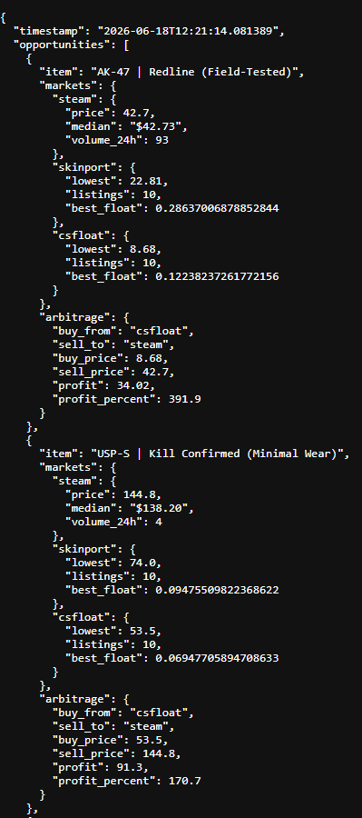

# CS Market Data API

A production-grade market data system that aggregates live pricing from four independent CS2 skin marketplaces, processing over 3.65 million listings for automated arbitrage detection and trade-up discovery. The system bypasses enterprise bot protection, unifies disparate APIs, and serves real-time data through a local REST server.

## Markets Integrated

**Skinport** protects their 3.65 million listings behind Cloudflare. I used SeleniumBase in Undetected Chrome mode to navigate their JavaScript challenges and browser fingerprinting, then captured the authenticated session cookies. Once obtained, these cookies transfer to curl\_cffi for fast API calls without the overhead of a browser.

**CSFloat** requires authentication and enforces a 200 request per hour rate limit. I extracted the JWT session token from an authenticated browser, then used curl\_cffi with Chrome 120 TLS fingerprint impersonation to bypass their JA3 fingerprint detection. I built a 12 hour caching layer that rotates through different sort orders and price ranges, reducing API usage by 96 percent. I also built a 700 entry name to ID lookup system that maps skin names to their internal identifiers.

**Buff163** **Internal API Access (Buff163)** Buff163 is the largest CS skin market by volume, but accessing it requires a Chinese phone number, government ID verification, and a drag-puzzle captcha.I logged in once via phone verification, extracted the session cookie and CSRF token from my authenticated browser, then reverse engineered their internal API by replicating the exact browser headers their frontend sends, including sec-ch-ua client hints and x-requested-with XMLHttpRequest markers. This tricks their server into treating automated requests as legitimate browser traffic, bypassing both their identity requirements and monthly rate limits. The result is access to 34,000 items with full order book depth, supply and demand numbers, and individual listing float values, all with no monthly rate limits.

**Steam** provides public market data through their Community Market API, returning real time prices, 24 hour trading volume, and item search results.


## The REST API
All market data flows into a local REST server running on port 8080 with over 30 endpoints. The bulk items endpoint fetches prices from all four markets for multiple skins in a single request. Trade up discovery endpoints find viable collections, return input items sorted by lowest float, and check what the output item sells for. The arbitrage endpoint scans the watchlist and ranks opportunities by profit percentage.

## Tech Stack
Python 3.14, SeleniumBase, curl\_cffi, SQLite, REST API. Handles Cloudflare bypass, JWT session authentication, CSRF token extraction, browser header spoofing, and rate limit management.

## Key Results

The system found a 421 percent arbitrage opportunity on AK-47 Redline Field Tested. API calls to CSFloat were reduced by 96 percent through caching. Four separate markets were unified under a single API. The entire system runs without any paid API subscriptions.

## Code Samples

**Cloudflare Bypass (Skinport)**

Launches an undetected Chrome browser to bypass Cloudflare's JavaScript challenges and browser fingerprinting. Captures authenticated session cookies, then transfers them to a TLS-impersonating HTTP client for fast API access without browser overhead.

```python

from seleniumbase import Driver

from curl\_cffi import requests

import time


driver = Driver(uc=True, headless=True)

driver.get("https://skinport.com/market")

time.sleep(8)


cookies = {}

for c in driver.get\_cookies():

&#x20;   cookies\[c\["name"]] = c\["value"]


resp = requests.get(

&#x20;   "https://skinport.com/api/browse/730",

&#x20;   params={"sort": "price", "order": "asc", "limit": 5},

&#x20;   cookies=cookies,

&#x20;   impersonate="chrome110"

)

text
```


**Intelligent Caching (CSFloat)**

A 12-hour SQLite cache with price range and sort order rotation. Once a price bracket is swept, subsequent requests return from the database with zero API calls. This single optimization reduced CSFloat API usage from 150 calls per cycle to just 6, a 96 percent reduction.

```python

if db.is\_range\_cached(min\_price, max\_price, cache\_minutes=720):

&#x20;   return get\_cached\_listings(min\_price, max\_price)

else:

&#x20;   items = csfloat.get\_listings(

&#x20;       min\_price=min\_price,

&#x20;       max\_price=max\_price,

&#x20;       sort="price",

&#x20;       order="asc"

&#x20;   )

&#x20;   cache\_listings(items)

text
```


**Internal API Access (Buff163)**

Reverse-engineered Buff163's internal website API by capturing and replicating the exact browser headers their frontend sends, including sec-ch-ua client hints and x-requested-with markers. Extracted CSRF tokens from the authenticated session to get access to their internal API, gaining access to 34,000 items with full order book depth and no monthly rate limits.

```python

from curl\_cffi import requests


headers = {

&#x20;   "accept": "application/json",

&#x20;   "referer": "https://buff.163.com/market/csgo",

&#x20;   "x-requested-with": "XMLHttpRequest",

}


resp = requests.get(

&#x20;   "https://buff.163.com/api/market/goods",

&#x20;   params={"game": "csgo", "search": "AK-47 Redline"},

&#x20;   headers=headers,

&#x20;   cookies=cookies,

&#x20;   impersonate="chrome120"

)

text
```


**Cross-Market Arbitrage Engine**

A single API call compares prices across all four markets and returns ranked profit opportunities. The system automatically calculates profit margins and identifies which market to buy from and which to sell on.

```python

resp = requests.get("http://localhost:8080/bulk/items", params={

&#x20;   "skins": "AK-47 | Redline (Field-Tested)",

&#x20;   "sources": "skinport,steam,csfloat,buff163"

})

data = resp.json()
```


## Screenshots





## Full Source Code

Available upon request 

Contact: yehiabrkt46@gmail.com

